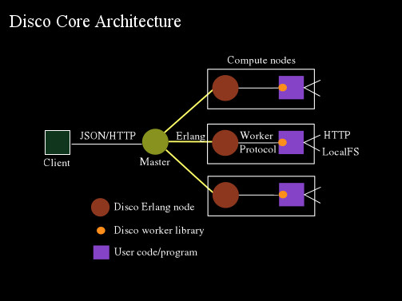
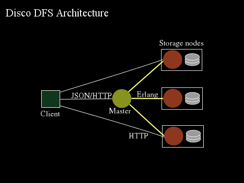

## Introduction

An LFE client library for the [Disco](https://github.com/discoproject) big-data platform.


## Dependencies

This project assumes that you have [rebar](https://github.com/rebar/rebar)
and [lfetool](https://github.com/lfe/lfetool) installed somwhere
in your ``$PATH``.


## Installation

To inlcude ``ldisco`` in your project, simply update the deps section
of your ``rebar.config``:

```erlang

    {deps, [
      {ldisco, ".*", {git, "git://github.com/thorgisl/ldisco.git"}}
    ]}
```


## Usage

TBD (project still in-progress; worker protocol will likely be the first bit
done)


## Architecture

Disco Core and DFS have the overall architectures as depicted in the following
diagrams:






## Disco Logic Flow

The logical flow of code through Disco system can be broken down into the
following major areas:

1. End-user-created code (e.g., ``map`` and ``reduce`` functions)
1. Creation of job files
1. Delivery of job files to Disco server
1. Job data delivery and unpacking to worker nodes
1. Worker node execution of job
1. Delivery of results to Disco
1. Retrieval of results by end-user from Disco


## An LFE Client Library

With all that background understood, it's possible to create a client library
in any language. Our choice, of course, is LFE :-)


### Initial Plan

In order to build an LFE Disco client, the following components were needed:

1. Disco configuration mechanicsm for LFE
   * so the client knows where Disco is (port, host, etc.)
   * as well as other settings
1. Worker implementation
   * Something that can read and write the Disco worker protocol
   * Something that can read from stdout and write to stdin
   * Something that can exercise all possible workflows in the communications
     between the Disco server and the LFE Disco worker
   * Data structures representing tasks, inputs, outputs, replicas, etc.
   * Higher-level abstractions for simplifying complicated workflows
1. Disco client implementation
   * HTTP/JSON
   * queries to Disco server, etc.
   * results parsing
1. Instructions for end-users on how to create Disco jobs in LFE.

Disco can be used for the following:
 * submitting an LFE jobpack to Disco via ``./bin/disco submit <file>``
 * delivery of results to Disco happens as part of the worker writing to
   ``stdout``
 * in-band retrieval of results happens via the worker protocol, possibly
   wrapped in higher-level abstractions


### Components

XXX


## Terms

Disco
: XXX

Disco server
: XXX

Disco worker
: XXX

Disco protocol
: XXX

Disco tasks
: XXX

ldisco
: XXX

ldisco worker
: XXX

